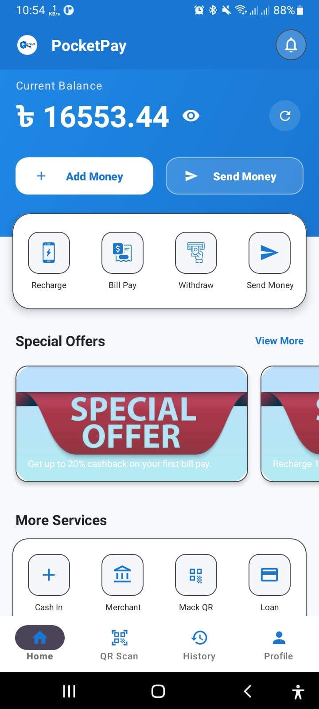
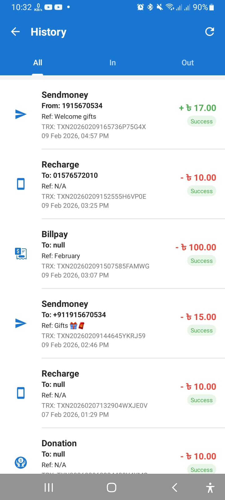
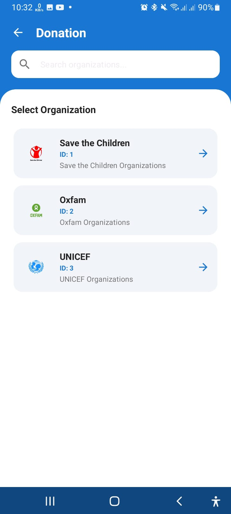
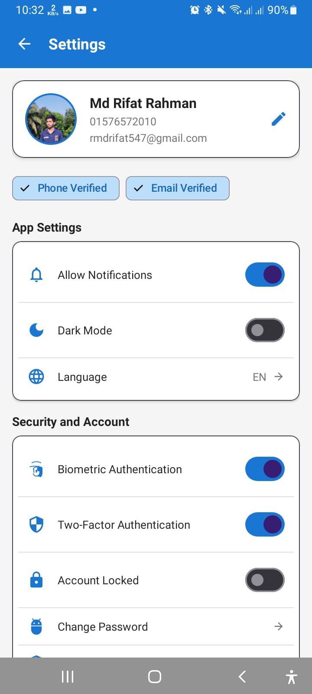

# 🚀 Md Rifat Rahman

Welcome to my portfolio repository!  
This README showcases my profile, skills, projects, and how to contact me.

Live Portfolio 👉 https://rifatsoftdev.netlify.app/

---

## 👋 About Me

Hi! I’m **Md Rifat Rahman**, an aspiring **Software Engineer** from Bangladesh.  
I’m passionate about coding, solving problems, and building impactful software that makes life easier. Currently I’m learning and improving in full-stack development while participating actively in competitive programming.

---

## 🧠 What I Do

-  Full-stack Web Development  
-  Competitive Programming (400+ problems solved)  
-  Python, C++, Java development  
-  Learning new technologies and best practices continuously.

---

## 🛠️ Skills & Tools

### Languages
- **Python**
- **C++**
- **Java**

### Web Development
- Backend & Frontend
- HTML / CSS
- JavaScript

### Backend Development
- Python FastAPI
- MySQL

### Other
- Competitive Programming
- Problem Solving  

---

## 📊 Achievements

- ✅ Solved **400+ problems** on different platforms  
- ✅ Completed **10+ full-stack projects**  
- ✅ Dedicated learner and growing developer

---

## 📂 Projects

### 1. 💰 PocketPay - Personal Finance Management App

PocketPay is a modern personal finance management application that helps users track income, expenses, and manage daily transactions efficiently.

#### ✨ Features
- 📊 Track income & expenses
- 🗂️ Transaction history management
- 📈 Financial overview dashboard
- 🔐 Secure user authentication

#### 🛠️ Tech Stack
- Java (Android)
- XML UI Design
- Firebase
- FastAPI

#### 🎯 Purpose
The goal of PocketPay is to simplify daily money tracking and improve financial awareness through a clean and user-friendly interface.

#### 📷 Screenshots

#### 🔗 Links
- APK: Available locally
- Source Code: Private repository

---

## 📫 Contact

Feel free to connect with me:

- 📧 **Email:** rifatsoft.dev@gmail.com
- 🔗 **GitHub:** [rifatsoftdev](https://github.com/rifatsoftdev)
- 🔗 **Portfolio:** [rifatsoftdev](https://rifatsoftdev.netlify.app/)
- 🔗 **LinkedIn:** [Md Rifat Rahman](https://www.linkedin.com/in/rifatsoftdev/)
- 🔗 **Instagram:** [@rifatsoftdev](https://www.instagram.com/rifatsoftdev/)
- 🔗 **LeetCode:** [@rifatsoftdev](https://leetcode.com/u/rifatsoftdev/)

---

## 📄 Resume

👉 Download my CV from my portfolio home page.

---

## ❤️ Thank You!

Thanks for visiting my profile!  
I’m always open to collaboration, learning, and exciting opportunities.
